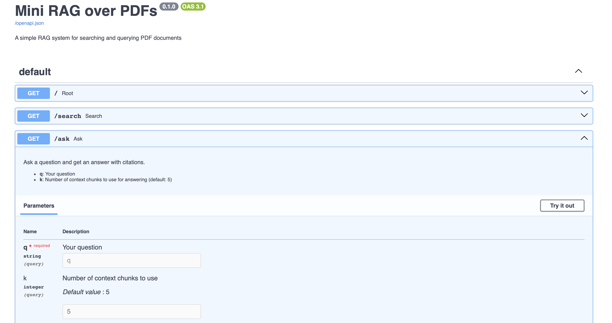

# PDF RAG System



A professional, end-to-end RAG (Retrieval-Augmented Generation) system that enables intelligent document processing, semantic search, and question-answering over PDF documents.

## 🚀 Features

- **PDF Ingestion**: Parse and chunk PDF documents with metadata tracking
- **Vector Search**: Semantic similarity search using sentence-transformers
- **Hybrid Search**: Combine vector similarity with BM25 for better results
- **REST API**: FastAPI endpoints for search and Q&A
- **Evaluation**: Built-in evaluation framework for measuring retrieval quality
- **Persistent Storage**: ChromaDB for vector storage with persistence

## 📁 Project Structure

```
pdf-rag-system/
├── data/                 # Put your PDFs here
├── store/                # ChromaDB persistent directory (auto-created)
├── app/
│   ├── __init__.py
│   ├── ingest.py         # PDF ingestion and vector storage
│   ├── query.py          # Vector and hybrid search
│   ├── api.py            # FastAPI endpoints
│   ├── eval.py           # Evaluation framework
│   └── utils.py          # Utility functions
├── requirements.txt
└── README.md
```

## 🛠️ Setup

1. **Create virtual environment**:
   ```bash
   python -m venv .venv
   source .venv/bin/activate  # On Windows: .venv\Scripts\activate
   ```

2. **Install dependencies**:
   ```bash
   pip install -r requirements.txt
   ```

3. **Add PDFs to data directory**:
   ```bash
   # Copy your PDF files to the data/ directory
   cp your_documents/*.pdf data/
   ```

## 🚀 Usage

### 1. Ingest PDFs

Process your PDFs and build the vector index:

```bash
python app/ingest.py
```

This will:
- Load all PDFs from the `data/` directory
- Chunk text into overlapping segments
- Generate embeddings using sentence-transformers
- Store vectors in ChromaDB with metadata

### 2. Start the API Server

```bash
uvicorn app.api:app --reload
```

The API will be available at `http://127.0.0.1:8000`

### 3. Use the API

#### Interactive Documentation
Visit `http://127.0.0.1:8000/docs` for interactive API documentation.

#### Search Endpoints

**Semantic Search**:
```bash
curl "http://127.0.0.1:8000/search?q=your search query&k=5&hybrid=true"
```

**Ask Questions**:
```bash
curl "http://127.0.0.1:8000/ask?q=your question&k=5"
```

#### Example API Calls

```python
import requests

# Search for relevant documents
response = requests.get("http://127.0.0.1:8000/search", params={
    "q": "What is the refund policy?",
    "k": 5,
    "hybrid": True
})
results = response.json()

# Ask a question
response = requests.get("http://127.0.0.1:8000/ask", params={
    "q": "How do I reset my device?",
    "k": 3
})
answer = response.json()
```

### 4. Evaluate Performance

Run evaluation tests to measure retrieval quality:

```bash
# Basic evaluation
python app/eval.py

# Comparison across different k values
python app/eval.py compare
```

## 🔧 Configuration

### Chunking Parameters

Edit `app/utils.py` to adjust chunking behavior:

```python
def chunk_text(text: str, chunk_size=800, chunk_overlap=120) -> List[str]:
    # chunk_size: number of tokens per chunk
    # chunk_overlap: overlap between consecutive chunks
```

### Search Parameters

In `app/query.py`, you can adjust:

- **Hybrid search weight** (`alpha`): Balance between vector similarity and BM25
- **Model**: Change the sentence transformer model
- **Search parameters**: Adjust k values and search strategies

## 🎯 API Endpoints

### GET `/`
Root endpoint with basic information.

### GET `/search`
Semantic search over documents.

**Parameters**:
- `q` (required): Search query
- `k` (optional, default: 5): Number of results
- `hybrid` (optional, default: true): Use hybrid search

**Response**:
```json
[
  {
    "id": "document.pdf::p1::c0",
    "text": "chunk text...",
    "source": "document.pdf",
    "page": 1,
    "score": 0.85
  }
]
```

### GET `/ask`
Ask questions and get answers with citations.

**Parameters**:
- `q` (required): Your question
- `k` (optional, default: 5): Number of context chunks

**Response**:
```json
{
  "answer": "Based on the documents...",
  "citations": [
    {"source": "document.pdf", "page": 1}
  ]
}
```

### GET `/health`
Health check endpoint.

## 🔬 Evaluation

The evaluation framework (`app/eval.py`) includes:

- **Recall@k**: Measures how often relevant content appears in top-k results
- **Sample test cases**: Pre-defined queries for common scenarios
- **Comparison tools**: Test different k values and search strategies

### Custom Evaluation

Add your own test cases to `TESTS` in `app/eval.py`:

```python
TESTS = [
    {"q": "Your question here?", "must_contain": ["keyword1", "keyword2"]},
    # Add more test cases...
]
```

## 🚀 Stretch Goals

1. **Swap Vector Database**: Replace ChromaDB with Qdrant or Weaviate
2. **Add Reranking**: Implement cross-encoder reranking for better precision
3. **LLM Integration**: Connect to OpenAI, Anthropic, or local models
4. **Advanced Chunking**: Implement heading-aware or sentence-boundary chunking
5. **Metadata Filtering**: Add source and page range filters
6. **Real-time Updates**: Watch for PDF changes and auto-reingest

## 🐛 Troubleshooting

### Common Issues

1. **No PDFs found**: Make sure you have PDF files in the `data/` directory
2. **Import errors**: Ensure you're in the virtual environment and all dependencies are installed
3. **ChromaDB errors**: Delete the `store/` directory and re-run ingestion
4. **Memory issues**: Reduce chunk size or use smaller embedding models

### Performance Tips

- Use smaller embedding models for faster processing
- Adjust chunk size based on your document characteristics
- Tune hybrid search alpha parameter for your use case
- Consider using GPU acceleration for embedding generation

## 📚 Learning Resources

- [ChromaDB Documentation](https://docs.trychroma.com/)
- [Sentence Transformers](https://www.sbert.net/)
- [FastAPI Documentation](https://fastapi.tiangolo.com/)
- [RAG Best Practices](https://arxiv.org/abs/2312.10997)

## 🤝 Contributing

Feel free to submit issues, feature requests, or pull requests to improve this mini RAG system!

## 📄 License

This project is open source and available under the MIT License. 